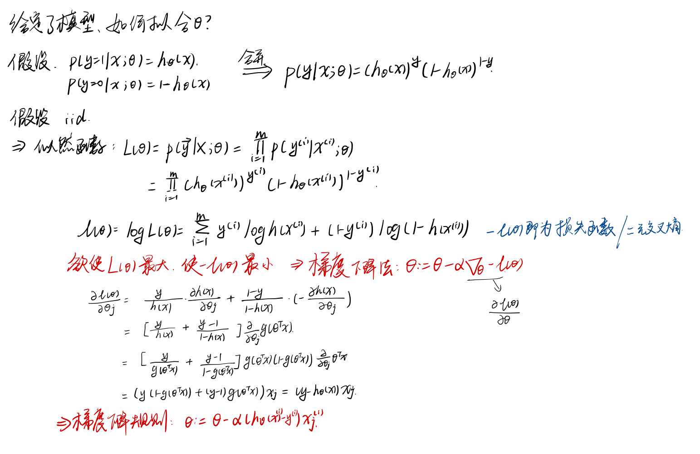

# Logistic Regression & Softmax Regression

[toc]

## $Logistic$回归

$Logistic$回归是一种常见的用于处理**二分类问题**的线性分类模型。
> 所谓线性分类模型：决策边界为线性超平面

**模型：**
$$
\hat{y} = \sigma(wx+b)
$$

> - $\sigma()$为激活函数，作用是**将线性函数的值域从实数区间“挤压”到$(0,1)$之间**，可用来表示概率。$\sigma = \frac{1}{1+e^{-z}}$
> - $\hat{y}$的意义为$p(y=1|x,w)$即给定$x$和参数$w$时$y=1$的估计概率。
>   - 若$\hat{y}>0.5$，即$wx+b>0$，得出分类$y=1$。

参考线性回归损失函数：
$$
损失函数 loss = (\hat{y} - y)^2 \\
代价函数 cost = \frac{1}{N}\sum_{n=1}^N(\hat{y_n}-y_n)^2
$$

### $Logistic$的损失函数是什么？如何拟合$Logistic$的参数$w$？

==**$Logistic$回归采用交叉熵$(BCE\ loss)$作为损失函数，并使用梯度下降法对参数进行优化**==

#### 最大似然估计角度解释

> 似然函数$L(\theta)$是描述不同$\theta$，出现这个样本点$\overrightarrow{y}|x$的概率。故要求使$L(\theta)$最大的$\theta$(即拟合参数$\theta$的过程)

  

---

#### 交叉熵角度解释

KL散度是衡量两个概率分布的差异

**对于$Logistic$回归，假设真实的$label$概率分布为$P(x)$,模型预测的为$Q(x)$，那么就可以用KL散度衡量预测值与真实值概率模型之间的差异**；

KL散度公式：

$$
D_{KL}(P||Q) = \sum_{i=1}^m p_i((-logq_i) - (-logp_i))\\
=\sum_{i=1}^m p_i(-logq_i) - \sum_{i=1}^m p_i(-logp_i)
= H(P,Q) - H(P)
$$

然后$H(P)$(真实值的熵)为固定值，**所以$H(P,Q)$交叉熵越小，KL散度越大，预测值与真实值之间差异越大，故选取交叉熵作为$logistic$回归的损失函数**。

交叉熵公式：

$$
H(P,Q) = -\sum_{i=1}^m p_i\ logq_i
$$

$logistic$回归中$m=2$，得到**二元交叉熵**：
$$
H(P,Q) = -( p_1(logq_1) + p_2(logq_2) )\\
 =  -( p_1(logq_1) + (1-p_1)(log(1-q_2)))\\
 = -(ylog(h_\theta (x)) + (1-y)log(1-h_\theta (x)))
$$

---

综上：
**Logistic交叉熵**损失函数如下$BCEloss$：
$$
损失函数 loss = -(ylog(\hat{y}) + (1-y)log(1-\hat{y}))
$$

$$
代价函数 cost = -\frac{1}{N} \sum_{n=1}^N y_nlog(\hat{y_n}) + (1-y_n)log(1-\hat{y_n})
$$

$$
\frac{\partial cost}{\partial w} = -\frac{1}{N}\sum_{n=1}^N x_n(y_n-\hat{y_n})
$$

然后利用梯度下降法进行迭代更新参数：
$$
w = w -\alpha \frac{\partial cost}{\partial w}
$$

## $Softmax$回归

$Softmax$回归又称多项/类的$Logistic$回归，是$Logistic$回归在多分类问题上的推广。

在$Logistic$回归中，对于二分类问题可以为**单节点输出**$P(A|x)$，用以表示事件A发生的概率；还可以为**双节点输出**$P(A|x)和P(\overline{A}|x)$，此时需满足约束$P(A|x)+P(\overline{A}|x)=1$，将节点的输出值变成一个概率分布(值$\in[0,1]$;和为1)。

可以将输出为两个节点的二分类**推广**成拥有n个输出节点的n分类问题。$Softmax$函数就是**将各节点的输出值映射到$[0,1]$，并且约束节点输出值之和为1**的函数。

> Softmax的含义就在于不唯一的确定某一个最大值(Hardmax)，而是为每个输出分类的结果都赋予一个概率值，表示属于每个类别的可能性。

模型：
$$
P(y=c|x) = softmax(z) = \frac{e^z}{\sum_{c=1}^C e^z_c}\\
其中：z=wx
$$

决策函数为：
$$
\hat{y} = {\underset{c}{argmax}}p(y=c|x)
$$

### $Softmax$的损失函数是什么？如何拟合$Softmax$的参数w？

$Softmax$回归使用交叉熵损失函数学习最优的参数矩阵$W$
