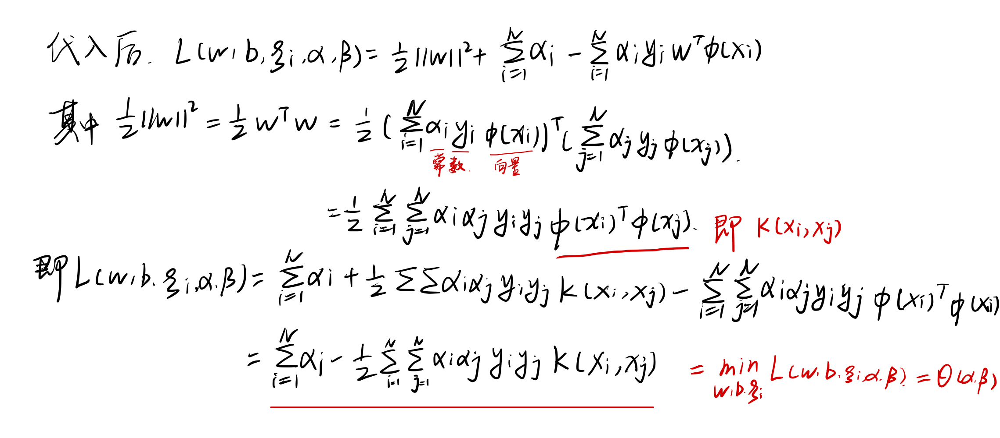

# SVM

[toc]

## 线性模型

#### 一、如何从图形层面找出分类边界？

我们画出一条分类边界，然后将边界向两侧平移接触到一个或同时接触到多个分类点$(支持向量support\ vector)$ 为止，此时两条平行线之间的距离称作**间隔$margin$**，然后我们所要找的边界即为使间隔最大的那两条边界的中线。

#### 二、何为线性可分？

一个训练集$\{(x_i,y_i)\}_{i=1-N}$线性可分是指：
$$
\begin{equation}
\begin{split}
\exists (w,b)使：对于\forall \ i=1-N有：\\
若\ y_i=+1,则w^Tx_i+b≥0\\
若\ y_i=-1,则w^Tx_i+b<0\\
即\ y_i(w^Tx_i+b)≥0
\end{split}
\end{equation}
$$

#### 三、求线性可分数据的划分超平面$(hyperplane) \quad w^Tx+b=0\quad$如何转化为如下凸优化问题？如何从图形形象层面转化为数学语言描述的？

*(凸优化问题，二次规划问题(凸优化的一种))*
$$
\begin{equation}
\begin{split}
& \min_{w,b} \frac{1}{2}||w||^2\\
& s.t.\quad y_i(w^Tx_i+b)≥1, \quad i=1-N.
\end{split}
\end{equation}
$$

**事实1**：$w^Tx+b=0与aw^Tx+ab=0,a\in R^+$  是同一个平面。即若$(w,b)$满足公式$(1)$,那么$(aw,ab)$也满足公式$(1)$。
**事实2**：空间一点$x$到超平面$(w,b)$的距离为：$d=\frac{|w^Tx+b|}{||w||}$

**我们可以用a去缩放$(w,b)->(aw,ab)$，最终使在所有支持向量$x_0$上有$|w^Tx_0+b|=1$，此时支持向量$x_0$与平面的距离$d=\frac{1}{||w||}$**
> 改变$a$，划分超平面不变，但$w和b$有所改变，假如原先$|w^Tx_0+b|=\beta$，那么此处只需令$a=1/\beta$即可实现$|w^Tx_0+b|=1$

所以要想让间隔$\frac{2}{||w||}$更大，只需$\min\limits_{w,b}\frac{1}{2}||w||^2$；此外，支持向量以外的点到平面的距离必须要$>1$,而且要满足训练样本线性可分(公式(1)),故需满足条件$y_i(w^Tx_i+b)≥1$
> 首先$y_i(w^Tx_i+b)≥0$，其次由于$|w^Tx_i+b|≥1$，故$y_i(w^Tx_i+b)≥1$

批注：

>1. $s.t.$的右端的1可以是其他数值，无非是变一下$a$。
>2. **二次规划问题**：目标函数是二次项 && 限制条件是一次项
>   二次规划问题要么无解(问题不线性可分)，要么只有一个极值，即局部极值即最值。

## 非线性模型

对于线性不可分的训练集，优化问题如下：

### 引入松弛变量$\xi_i$

**先引入松弛变量$\xi_i$**，此时可解决训练集非线性可分(决策边界
仍然是线性的，但找不到一条直线分开所有训练集)的情况。

$$
\begin{equation}
\begin{split}
& \min_{w,b,\xi} \frac{1}{2}||w||^2 + C\sum_{i=1}^N \xi _i \\
s.t. \quad & y_i(w^Tx_i+b)≥1 - \xi_i, \quad i=1-N.\\
& \xi _i ≥0, \quad i=1-N
\end{split}
\end{equation}
$$

> 1. 约束条件增加N个，$\xi_i$称作松弛变量
> 2. 每个样本点对应一个$\xi_i$；$\xi_i>1$：分类错误；$\xi_i=1$：在分类超平面上；$\xi_i \in (0,1)$：分类正确但确信度不是最大；$\xi_i≤0$：点在间隔边界上或之外；
> 3. 目标函数中需要控制$\xi_i$都要比较小
> 4. $ C\sum_{i=1}^N \xi_i$被称作正则项$regulation\ term$
> 5. $C$是事先设定的参数，称作惩罚参数，$C>0$

### 引入高维映射函数$\phi(x)$

**进一步引入高维映射$\phi(x)$**
$$x -> \phi(x) \quad低维 -> 高维$$

那么优化问题变成：
$$
\begin{equation}
\begin{split}
& \min_{w,b,\xi} \frac{1}{2}||w||^2 + C\sum_{i=1}^N \xi _i \\
s.t. \quad & y_i(w^T\phi(x_i)+b)≥1 - \xi_i, \quad i=1-N.\\
& \xi_i ≥0, \quad i=1-N
\end{split}
\end{equation}
$$

#### 一、那么如何选取 / 求出$\phi(x)$? 不用求!

**首先$\phi(x)$常是无限维**，**伴随着，你需要求出无限维的$w$，那么该优化问题无法求解。**
那么**精髓**来了，**利用一个有限维的手段做出了无限维的**$\phi(x)$:
我们可以不知道无限维映射$\phi(x)$的显示表达，我们只要知道一个**核函数**$Kernel\ Function$:
$$
K(x_1,x_2) = \phi(x_1)^T\phi(x_2)
$$

那么上述优化问题仍然可解。

> 注：核函数的自变量$x_1,x_2$是低维向量，核函数的结果是两个无限维向量$\phi(x_1),\phi(x_2)$的内积(一个数)。

**常用核函数：**
$$
高斯核 \quad K(x_1,x_2) = exp(-\frac{||x_1-x_2||^2}{2\sigma^2})=\phi(x_1)^T\phi(x_2)
$$

$$
多项式核 \quad K(x_1,x_2) = (x_1^Tx_2+1)^d=\phi(x_1)^T\phi(x_2)
$$

根据证明，高斯核可拆分为无限维度的$\phi(x_1)^T\phi(x_2)$，我们只需要知道$K$，并不需要知道$\phi(x)$的具体形式。多项式h核可拆分为有限维度吧。
> $K(x_1,x_2)$能写成$\phi(x_1)^T\phi(x_2)$的充要条件($Merces's theorem$)：
> ① $K(x_1,x_2) = K(x_2,x_1) \quad (交换性)$
> ②$\forall c_i,x_i (i=1-N),有:\sum\limits_{i=1}^N \sum\limits_{j=1}^N c_ic_jK(x_i,x_j) ≥0 \quad(半正定性)$

#### 二、如何求优化问题(式($4$))(利用核函数$K$)?

**1、先根据对偶理论中原问题$(prime\ problem)$形式，转化一下优化问题**(4):
$$
\begin{equation}
\begin{split}
& \min_{w,b,\xi} \frac{1}{2}||w||^2 - C\sum_{i=1}^N \xi _i \\
s.t. \quad &  1+\xi_i-y_iw^T\phi(x_i)-y_ib \leq 0 , \quad i=1-N.\\
& \xi_i \leq 0, \quad i=1-N
\end{split}
\end{equation}
$$

> P问题：
> $$\min\limits_{x \in \mathbf{R}^{n}} f(x) \\s.t. \quad c_{i}(x) \leqslant 0, \quad i=1,2, \cdots, k\\
\quad \quad h_{j}(x)=0, \quad j=1,2, \cdots, l
$$

**2、将原问题转为对偶问题**$(dual\ problem)$
$$
\begin{equation}
\begin{split}
& \max_{\alpha,\beta} \theta(\alpha, \beta)=\max_{\alpha,\beta} \min_{w, b , \xi_{i}} \frac{1}{2}\|w\|^{2}-C\sum_{i=1}^{N} \xi_{i}+\sum_{i=1}^{N} \beta_{i} \xi_{i}+\sum_{i=1}^{N} \alpha_{i}\left(1+\xi_{i}-y_{i} w^T\phi\left(x_{i}\right)-y_{i} b\right).\\
& \text { s.t. }\left\{\begin{array}{l}
\alpha_{i} \geqslant 0 ,\quad i=1 \sim N \\
\beta_{i} \geqslant 0 ,\quad i=1 \sim N
\end{array}\right.
\end{split}
\end{equation}
$$

> D问题：
> $$
\begin{array}{c}
\max\limits_{\alpha, \beta} \theta_{D}(\alpha, \beta)=\max \limits_{\alpha, \beta} \min\limits_{x} L(x, \alpha, \beta) \\
\text { s.t. } \alpha_{i} \geqslant 0, \quad i=1,2, \cdots, k
\end{array}
$$

那么欲求对偶问题的解，先求$\min\limits_{w,b,\xi_i}L(w,b,\xi_i,\alpha,\beta)$，那么需要求偏导：
$$
\begin{equation}
\begin{split}
\frac{\partial L}{\partial w} &= w - \sum_{i=1}^N \alpha_iy_i\phi(x_i)= 0
\\
\frac{\partial L}{\partial b} &= - \sum_{i=1}^N \alpha_iy_i = 0
\\
\frac{\partial L}{\partial \xi_i} &= -C + \beta_i + \alpha_i= 0
\end{split}
\end{equation}
$$

$$
所以w = \sum_{i=1}^N \alpha_iy_i\phi(x_i)
\\
\alpha_i+\beta_i=C
$$

将上述代入式子$(6)$:
  

即$\theta(\alpha,\beta) = \min L = \sum\limits_{i=1}^{N}\alpha_i - \frac{1}{2}\sum\limits_{i=1}^{N}\sum\limits_{j=1}^{N}\alpha_i\alpha_jy_iy_jK(x_i,x_j)$

**3、将对偶问题(6)变成**：
$$
\max_\alpha \theta(\alpha) = \sum\limits_{i=1}^{N}\alpha_i - \frac{1}{2}\sum\limits_{i=1}^{N}\sum\limits_{j=1}^{N}\alpha_i\alpha_jy_iy_jK(x_i,x_j
\\
s.t.\qquad 0\leq\alpha_i\leq C
\\
\qquad \ \ \ \ \  \sum_{i=1}^N\alpha_iy_i=0
$$
> 第一个约束条件是$\alpha_i\geq0,\beta_i\geq0,\alpha_i+\beta_i=C合并而来$
> 第二个约束来自于上述推导过程
> **此优化问题可通过$SMO$算法求解出$\alpha$**

**4、该求参数w和b了，还是说可以不用求直接做出决策？**
此时，我们需要求$w和b$，已知$w = \sum\limits_{i=1}^N \alpha_iy_i\phi(x_i)$，那么我们还是需要求$\phi(x)$，对吗？不对。
因为我们决策时，类别$y$：
$$y=sign(w^T \phi(x)+b) = sign(\sum_{i=1}^N \alpha_iy_iK(x_i,x)+b)$$

所以无需通过$\phi(x)$求$w$，利用$K(x_i,x)$即可，然后求出$b$即可。

**5、那么如何求$b$？**
根据$KKT$的对偶互补条件：$$\forall i=1-K,要么\alpha_i^*=0,要么c_i(x^*)=0$$
取一个$0<\alpha_i<C$，根据式子(5)，两个约束条件变为等式，据此得到：
$$
b = \frac{1-y_i\sum\limits_{j=1}^{N}\alpha_iy_iK(x_i,x_j) }{y_i}
$$

#### 三、$SVM$算法整体流程

**1、训练流程**
输入N个训练样本${(x_i,y_i)}$，解优化问题，解得$\alpha$:
$$
\max_\alpha \theta(\alpha) = \sum\limits_{i=1}^{N}\alpha_i - \frac{1}{2}\sum\limits_{i=1}^{N}\sum\limits_{j=1}^{N}\alpha_i\alpha_jy_iy_jK(x_i,x_j
\\
s.t.\qquad 0\leq\alpha_i\leq C
\\
\qquad \ \ \ \ \  \sum_{i=1}^N\alpha_iy_i=0
$$

取一个$0<\alpha_i<C$，计算$b$：
$$
b = \frac{1-y_i\sum\limits_{j=1}^{N}\alpha_iy_iK(x_i,x_j) }{y_i}
$$
> 注：现实中取所有满足$\alpha_i \in (0,C)$的$\alpha_i$，求出$b$的平均值 

**2、测试流程**
输入测试样本$x$
$$
y=sign(w^T \phi(x)+b) = sign(\sum_{i=1}^N \alpha_iy_iK(x_i,x)+b)
$$

完结撒花。