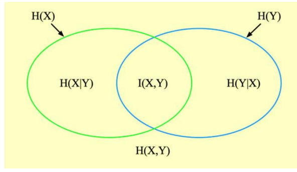
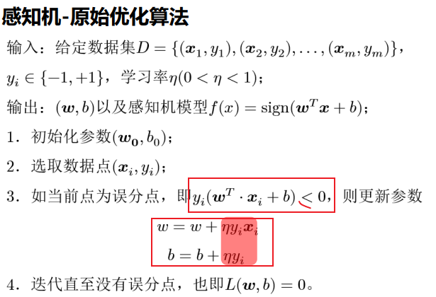

# Summary

[toc]

## 1. Nothing

pass

## 2. 特征选择

1. 过拟合：高方差
   1. 方差是模型在不同数据集上预测结果的差异程度，差异越大，方差越高
2. 欠拟合：高偏差
   1. 偏差是模型预测值与实际值的差异
3. 现在是DL自动提取特征，原来是手动，比如NLP用词袋特征、词频特征表示文本特征，CV中用Canny特征、颜色直方图、SIFT特征等；
4. 由于curse of dimension：**训练费劲、泛化弱、难解释、难可视化**，所以需要**维度约简**
   1. 维度约简：在保持数据某种特性情况下去除无关和冗余特征的过程；
   2. 特征变换：高位特征空间映射到低维
   3. 特征选择：就是选个**特征子集**，选择的特征应该**与任务强相关**，选择的**特征彼此之间冗余性小**；
      1. 去除学习任务无关和冗余的特征
      2. 特征选择分为：过滤式、包裹式、嵌入式
5. 信息量：pk是某件事发生的概率，概率越低，信息量越大
   1. ==$log_2(\frac{1}{p_k}) = -log_2(p_k)$==
6. 熵/信息熵：信息量的期望; 熵越大，不确定程度越大。
   1. $H(X) = -\sum\limits_{k=1}^n p_k log_2p_k$
7. 联合熵：==$H(X, Y) = -\sum\limits_{x} \sum\limits_{y} p_{xy}logp_{xy}$==
   1. 联合熵 > 每个独立的熵;
   2. 联合熵 ≤ 独立熵的和
   3. $H(X,Y) = H(X|Y)+I(X,Y)+H(Y|X)$
   4. $H(X,Y) = H(X)+H(Y)-I(X,Y)$
8. 条件熵（KL散度）：$H(Y|X) = H(X,Y) - H(X)$
9. 互信息：$I(X,Y) = H(Y) - H(Y|X) = H(X) - H(X|Y)$
   1. 互信息用于**衡量离散随机变量之间的相关性**
   2.   
10. **互信息最大化**特征选择：计算**目标变量**与**每个特征**的互信息，选最大的；
    1. 缺点：没考虑特征之间的冗余性
11. 互信息保持：每次将特征加到特征集合时，都需要计算此时集合中特征与目标变量的互信息，选增加最大的。确保加入新特征后集合与目标的互信息不下降；

---

1. 特征选择方法有哪些，简述各方法的优缺点。
   1. 过滤式
      1. 特征排序：相关系数
         1. 衡量特征与目标变量之间的相关系数，**绝对值越大，相关性越大**（==连续型==）
      2. 特征子集：互信息最大化特征选择
         1. 衡量特征与目标的互信息，越大越好（==离散型==）
   2. 包裹式
   3. 嵌入式

## 3. PCA

1. PCA是无监督降维，LDA是有监督降维
2. Principle Component Analysis: 原始数据通过特征向量变换成新数据，**使得变换后的数据方差最大**，**各主成分特征向量相互正交**，==通过取前𝑑′个特征值较大的向量来近似表达原矩阵==。
   1. **最大可分性**：方差最大，即在超平面上的投影尽可能分开
   2. **最近重构性**：样本点到超平面的距离足够近
   3. 取前d'个即维度约简
3. PCA优缺点：
   1. 优点：
      1. 各主成分之间独立，消除了原始特征之间的冗余性
      2. 计算简单，用SVD易于实现
      3. 可以降噪
   2. 缺点：
      1. 缺乏可解释性，各个主成分（维度）含义模糊
      2. 变量会出现零值，在某些领域不可解释
      3. 可能加剧过拟合

## 4. LDA&KNN

1. LDA - Linear Discriminant Analysis（线性判别分析）：想要找到一个投影矩阵W使得投影后的低维数据WTx具有**最大可分性**
   1. 同类聚集，不同类原理
   2. 我们利用了类别，去找到一个降维后的低维数据WTx，所以有监督
2. KNN - K-Nearest Neighbor：给定**测试样本**，基于某种距离度量找出训练集中与其最靠近的k个训练样本，然后基于这k个“邻居”的信息来进行预测。
   1. 分类：选取k个样本中最多的类别
   2. 回归：使用k个值的平均值，or按距离加权求和

## 5. Regression

1. 回归分析：研究自变量与因变量之间的依赖关系
2. 线性回归：
   1. 一元可以直接利用梯度求得MSE的闭式解（也即最小二乘法）
3. 梯度下降法：某点的梯度是函数在某点局部增加最快的方向，所以我们一般向着负梯度方向进行更新，使目标函数最小。
4. logistic regression:
   1. $y=\frac{1}{1+e^{-z}}$
   2. $z = w^Tx+b$
   3. $loss(x_i) = -(y_ilog\hat{y_i} + (1-y_i)log(1-\hat{y_i}))$ 即BCELoss

---

试分析不同正则化线性回归方法的优缺点。

## 6. Decision Tree

1. CLS随便选一个特征
2. ID3离散型，选信息增益大的特征
3. C4.5连续型，使用信息增益比
4. CART可用于分类和回归，使用基尼系数（二叉树）；可以防止过拟合
   1. 理想的决策树叶子结点数最少，叶子结点深度最小；
   2. 预剪枝：高效，容易欠拟合；后剪枝：低效，不容易欠拟合；
5. 信息增益：表示得知特征X的信息而使得类Y的信息的不确定性(熵)减少的程度
   1. 先计算总体数据的纯度（即熵），熵越小，纯度越高; $-\sum_i p_i log p_i$
   2. ==$Gain(D,A) = H(D) - H(D|A)$==
   3. ==$H(D|A) = \sum _i \frac{|D_i|}{|D|}H(D_i)$==

## 7. Perceptron&NN&BP

1. 单层感知机的目标函数：使**误分类**的所有样本到超平面的距离之和最小
   1. $loss = -\sum\limits _{x_i\in M} y_i(w^T x_i + b)$
   2. M是误分类点集合
2.   
3. 感知机对偶优化算法就是把n次优化合到一块了(maybe)

## 8. SVM

SVM: 将数据映射到高维空间中，并寻找一个超平面（平面、直线或曲面等）来分隔不同类别的数据。

## 9. Naive Bayes

1. 贝叶斯定理
   1. $p(A|B) = \frac{P(AB)}{P(B)} = \frac{P(B|A)P(A)}{\sum_i P(A_i)P(B|A_i)}$
2. naive bayes: 假设条件独立（即P(x_i|c)独立）
   1. $P(c|x) = \frac{P(c)P(x|c)}{P(x)}$
   2. 只需求: $\underset{c}{argmax}  P(c)  \prod \limits _i P(x_i|c)$

<!-- ## Kaggle

题目：电影评论情感分类，共五类：消极、有点消极、中性、有点积极、积极
训练集15.6w，测试集6.6w
方法一：logistic回归进行多分类(one vs rest)策略：

1. 合并所有语料，使用词袋模型将单词转为向量，进行特征提取，可以使用sklearn的CountVectorizer方法
2. 按照3：1将训练集划分为训练集和验证集，并转为数字特征
3. 使用logistic回复多分类，将多个分类结果选出一种作为一类，剩下的为另外一类，然后得到n个分类模型，最后选得分最高的

方法二：使用Bert预训练模型

1. bert预训练模型是在大规模语料中学习得到，所以他已经学会了很多词语之间的关系，对语言的语义有很多理解，能很方便地用到下游任务中，加速训练，加大准确度
2. 先使用autoTokenizer将数据映射为id，得到token表示
3. 使用huggingface封装好的函数进行训练
4. loss可以是cross-entropy -->